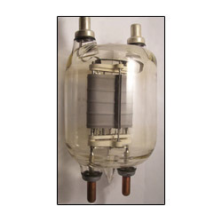

## La Historia de la fuente de alimentación

Los Primeros Ordenadores eran del tamaño de una habitación, consumían tanta energía como una pequeña ciudad (apagones) y necesitaban habitaciones adyacentes para alimentar toda la electrónica

Las fuentes de alimentación fueron adaptándose a la par de la **evolución de la electrónica** y los avances en los transistores.

Con la llegada del Ordenador Personal (PC) se comenzaron a estandarizar las conexiones y dimensiones de las fuentes de alimentación.

El primer estándar fué el factor de forma AT creado por **IBM** para el modelo 319. Se componía de dos conectores Molex de 6 pines.

Desde entonces se ha ido aumentando el número de pines para dar mas energía y más funcionalidades. Hoy se usa el ATX 20+4 pines

- [SIGUIENTE](ejercicio_perifericos2.md)
- [INDICE](ejercicio_perifericos.md)