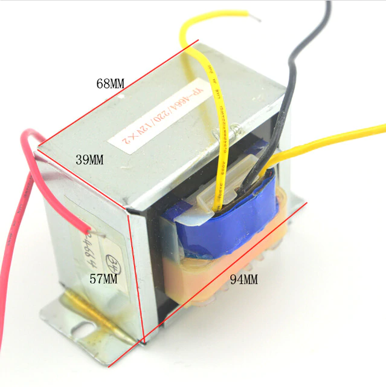
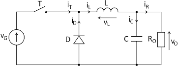

# Tipos de fuente de alimentación del PC
Existen dos tecnoclogías de fuente de alimentacion;
## Fuentes de alimentación **Lineales**
  Se basan en transformadores y resistencias
  
  
#### Menos eficientes
#### Más pesadas

## Fuentes de alimentación **conmutadas**
  
  

**Mucho más eficientes** Hasta un 99%
  Muy ligeras

- [ANTERIOR](ejercicio_perifericos1.md)
- [SIGUIENTE](ejercicio_perifericos3.md)
- [INDICE](ejercicio_perifericos.md)