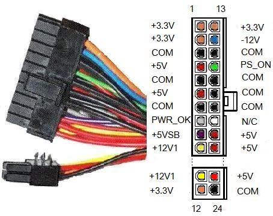
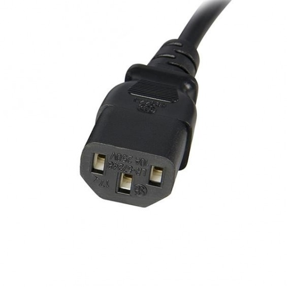
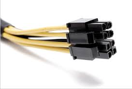
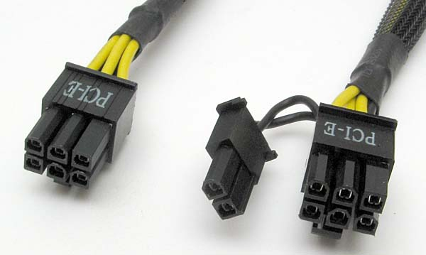
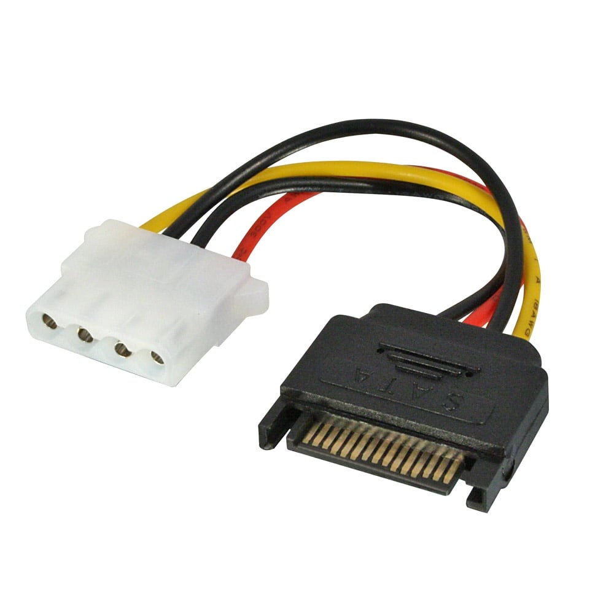
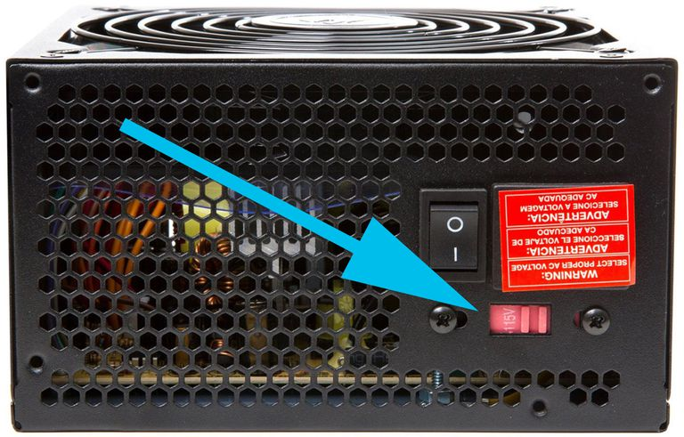
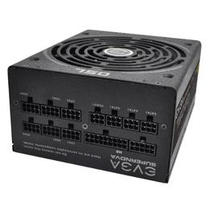

# Características de las PSU
### Estandar ATX
Dimensiones y voltajes permiten interoperabilidad
Colores de cables
Conectores

## Conectores
Conectores del estandar
* INPUT SHUCO

* CPU

 
* PLACA BASE (Ya visto)
* PCIe
  

* SATA-IDE 

## SWITCH VOLTAJE

## Modulares
Tienen los cables separados en latiquillos, para usar los necesarios y no dejar conectores o cables sun usar. Muy usados en casos estéticos

#### Sin refrigeración (refrigeración pasiva)
o con posibilidad de detener la ventilación para no generar ruido

#### Modding
#### Conexion USB / Monitorizada
#### Redundantes

#### Potencia
#### Amperios por rail

- [ANTERIOR](ejercicio_perifericos2.md)
- [INDICE](ejercicio_perifericos.md)